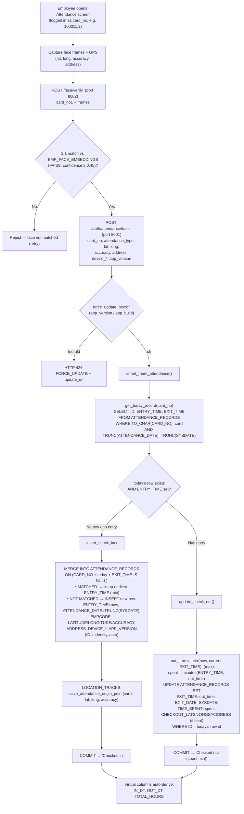

# Attendance — Check‑In / Check‑Out Flow

End‑to‑end flow for marking attendance, with the services, tables and columns
involved. The app captures attendance **only** into `ATTENDANCE_RECORDS`
(the ERP's `DUTY_ROSTER` is never written here).

---

## 1. Components

| Layer | Service | Role |
|---|---|---|
| Mobile | Android app | Captures face frames + GPS, orchestrates the two calls |
| Face service | `api:app` — **port 8002** | 1:1 face **verify** / 1:N **identify** |
| Core API | `main:app` — **port 8001** | `POST /auth/attendance/face` → mark attendance |
| Database | Oracle | `ATTENDANCE_RECORDS`, `EMP_FACE_EMBEDDINGS`, `LOCATION_TRACKS`, employee views |

---

## 2. Flow diagram (Mermaid)



---

## 3. Flow diagram (ASCII)

```
 MOBILE APP (logged in: card_no)
   │  capture face frames + GPS (lat, long, accuracy, address)
   ▼
 ┌──────────────────────────────────────────────┐
 │ POST /face/verify        (FACE API · 8002)    │
 │   body: card_no1, frames                      │
 │   → 1:1 match vs EMP_FACE_EMBEDDINGS (FAISS)  │
 └──────────────────────────────────────────────┘
   │ is_match == false ──────────► REJECT (retry)
   │ is_match == true
   ▼
 ┌──────────────────────────────────────────────┐
 │ POST /auth/attendance/face  (CORE API · 8001) │
 │   body: card_no, attendance_type, lat, long,  │
 │         accuracy, address, device_*, app_ver  │
 └──────────────────────────────────────────────┘
   │ force_update_block(app_version) ─► 426 FORCE_UPDATE
   ▼
 smart_mark_attendance(card_no, ...)
   │
   ├─► get_today_record(card_no)
   │      SELECT ID, ENTRY_TIME, EXIT_TIME
   │      FROM   ATTENDANCE_RECORDS
   │      WHERE  TO_CHAR(CARD_NO)=card
   │        AND  TRUNC(ATTENDANCE_DATE)=TRUNC(SYSDATE)
   │
   ├── no row / no ENTRY_TIME ─────────────► insert_check_in()
   │        MERGE INTO ATTENDANCE_RECORDS
   │          ON (CARD_NO + today + EXIT_TIME IS NULL)
   │          MATCHED     → ENTRY_TIME = earliest mark (min)
   │          NOT MATCHED → INSERT (ENTRY_TIME=now,
   │                        ATTENDANCE_DATE=TRUNC(SYSDATE),
   │                        EMPCODE, LAT/LONG/ACCURACY,
   │                        ADDRESS, DEVICE_*, APP_VERSION)
   │        + LOCATION_TRACKS (origin point)
   │        COMMIT → "Checked in"
   │
   └── has ENTRY_TIME ─────────────────────► update_check_out()
            out_time = later(now, EXIT_TIME)   (max)
            spent    = minutes(ENTRY_TIME, out_time)
            UPDATE ATTENDANCE_RECORDS SET
              EXIT_TIME=out_time, EXIT_DATE=SYSDATE,
              TIME_SPENT=spent,
              CHECKOUT_LATS/LONGS/ADDRESS (if sent)
            WHERE ID = today's row id
            COMMIT → "Checked out (spent min)"

 Derived automatically (virtual columns):
   IN_DT       = ENTRY_TIME + ATTENDANCE_DATE  → 'DD-MON-YY HH24:MI'
   OUT_DT      = EXIT_DATE                      → 'DD-MON-YY HH24:MI'
   TOTAL_HOURS = TIME_SPENT                     → 'HH:MM'
```

---

## 4. The "smart" rule

A day has **one** `ATTENDANCE_RECORDS` row per employee:

- **Check‑in = the earliest mark** of the day → `ENTRY_TIME` is the **minimum**.
- **Check‑out = the latest mark** of the day → `EXIT_TIME` is the **maximum**.
- A repeated/accidental tap only **pushes `EXIT_TIME` forward**; `ENTRY_TIME`
  never moves earlier than the first mark.

Decision used by `smart_mark_attendance`:

| Today's row | `ENTRY_TIME` | Action |
|---|---|---|
| none | — | `insert_check_in` (new row) |
| exists | empty | `insert_check_in` (fill entry) |
| exists | set | `update_check_out` (extend exit to latest) |

---

## 5. Tables & columns touched

### `ATTENDANCE_RECORDS` — the app's attendance store
| Column | Set on | Notes |
|---|---|---|
| `ID` | insert | PK, identity (auto — never supplied) |
| `EMPCODE` | check‑in | resolved from card |
| `CARD_NO` | check‑in | full company‑qualified card (e.g. `100011.3`) |
| `ENTRY_TIME` | check‑in | `HH:MM`, earliest mark (min) |
| `EXIT_TIME` | check‑out | `HH:MM`, latest mark (max) |
| `EXIT_DATE` | check‑out | `SYSDATE` — the actual check‑out date‑time |
| `TIME_SPENT` | check‑out | minutes between entry and exit |
| `ATTENDANCE_DATE` | check‑in | `TRUNC(SYSDATE)` — the day the row belongs to |
| `LATITUDE` / `LONGITUDE` / `ACCURACY` / `ADDRESS` / `FORMATTED_ADDRESS` | check‑in | **check‑in** location |
| `CHECKOUT_LATS` / `CHECKOUT_LONGS` / `CHECKOUT_ADDRESS` | check‑out | **check‑out** location (kept separate) |
| `ATTENDANCE_TYPE`, `DEVICE_ID`, `DEVICE_MODEL`, `APP_VERSION`, `TIMESTAMP` | check‑in | device / app metadata |
| `IN_DT` *(virtual)* | derived | `ENTRY_TIME`+`ATTENDANCE_DATE` → `DD-MON-YY HH24:MI` |
| `OUT_DT` *(virtual)* | derived | `EXIT_DATE` → `DD-MON-YY HH24:MI` |
| `TOTAL_HOURS` *(virtual)* | derived | `TIME_SPENT` → `HH:MM` |

### Supporting tables
| Table | Used for | Key columns |
|---|---|---|
| `EMP_FACE_EMBEDDINGS` | face **verify** (1:1) | `EMPCODE`, `EMBEDDING_BLOB`, `IS_ACTIVE` |
| `LOCATION_TRACKS` | day's marking **origin point** | card, latitude, longitude, accuracy, timestamp |
| `EMPLOYEE` / `HR_EMP_MASTER` | resolve `EMPCODE` from card | `CARD_NO`, `EMPCODE` |

---

## 6. Notes / edge cases

- **Identity**: `/auth/attendance/face` marks by the card it is given; the face
  **verify (1:1)** on port 8002 establishes that the live face belongs to the
  logged‑in employee. After login the app should not fall back to **identify
  (1:N)**, which can mis‑attribute.
- **Resilience**: id is an Oracle identity (no `MAX+1` race); transient errors
  (`ORA‑00001/00060/08177`) are retried.
- **Overnight shifts** (e.g. in 22:00 on the 16th, out 06:00 on the 17th) are
  **not yet** stitched into one row — the next‑day mark currently starts a new
  day's row. `EXIT_DATE` now being a real date‑time is the groundwork to fix
  this (close the prior open shift and compute the cross‑midnight duration).
```
